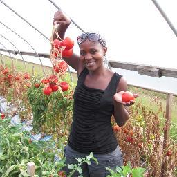

## About Me

My name is Carol Bogezi and this is my professional site. I recently earned my PhD in Wildlife Science from the University of Washington. I am currently seeking employment opportunities to apply my expertise to conservation program management and applied research. If you have any questions, please contact me: [cbogezi@gmail.com](mailto:cbogezi@gmail.com).

## Research Interest
I recently earned my PhD in Environmental Science at the [University of Washington](http:/www.uw.edu)'s School of Environment and Forest Sciences [(SEFS)](http://www.cfr.washington.edu/). My Urban Ecology lab advisor [Dr. John Marzluff](http://apps.sefs.uw.edu/Public/People/FacultyProfile.aspx?PID=10) secured a grant for the ["Feasibility of a Wolf Economy"](https://reeis.usda.gov/web/crisprojectpages/0232727-feasibility-of-a-wolf-economy-for-washington.html) that formed the basis of my dissertation.

I perform interdisciplinary research on wildlife conservation issues integrating social, ecological, and geographic sciences. My dissertation focused on understanding human-carnivore interactions in Washington state, particularly wolves in the context of their recovery, and cougars in the context of their habitat and ranging needs overlap with human recreation and habitation.

Previously, I undertook ecological research on *Crocodylus suchus* in Kidepo National Park in northeast Uganda. This crocodile population was discovered at the easternmost extent of this subspecies' range. I investigated the habitat occupancy within sub-basins in and around Kidepo.

<!-- ## Publications

1. F.Bar, J.Doe: Effects of having a placeholder of a name
2. S.Holmes, J.Watson: Consequences of living with a sociopath in London -->

## Awards / Scholarships

>Year | Award | Organization/Purpose
-----|-------|--------
2018 | [UW Husky 100](https://www.washington.edu/husky100/#name=carol-bogezi) | Recognized as one of the University of Washington's notable students.
2016 | "Top 40 Women Under 40" | Sunday Monitor newspaper, Uganda
2016 | [Environmental Leadership Prize](http://www.bullitt.org/programs/environmental-fellowship/) | Bullitt Foundation
2013 | [Wildlife Conservation Network Scholarship](https://wildnet.org/what-we-do/scholarships) | In support of PhD studies.
2011 | [Beinecke African Scholarship](http://fdnweb.org/beinecke/scholarships/africa/) | Awarded by [Wildlife Conservation Society (WCS)](https://www.wcs.org) to support PhD studies.
2009 | [Tropical Biology Association Scholarship](http://www.tropical-biology.org/) | In support of Master's Degree studies at Makerere University.

<!-- Here is a horizontal rule -->

---

## Personal Interests
My interests include education, women's empowerment, and community development particularly in Uganda. I serve as the President of [Tusubira](http://www.tusubira.org)'s volunteer board.

Additionally, I serve on the board of [Conservation Northwest](https://www.conservationnw.org).

<!-- > To a great mind, nothing is little -->

## References

* [John Marzluff, PhD](https://sefs.uw.edu/research/faculty-profile/john-marzluff/), University of Washington School of Environment and Forest Sciences Professor
<!-- * John Doe: Associate Professor, Department of Computer Science, Ipsum -->
